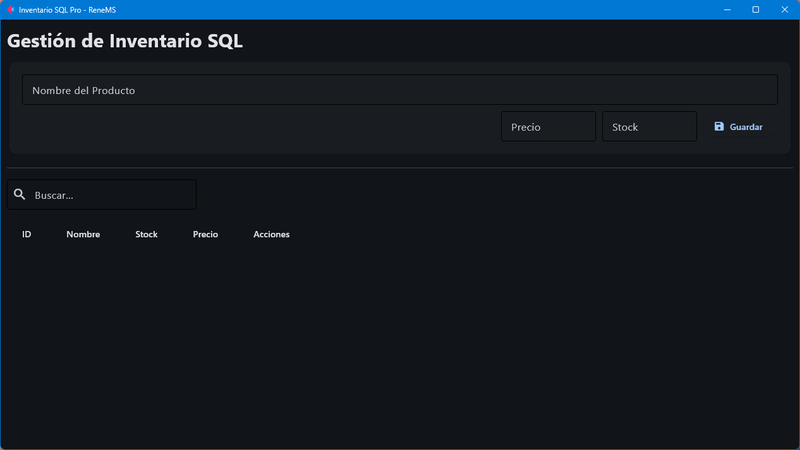
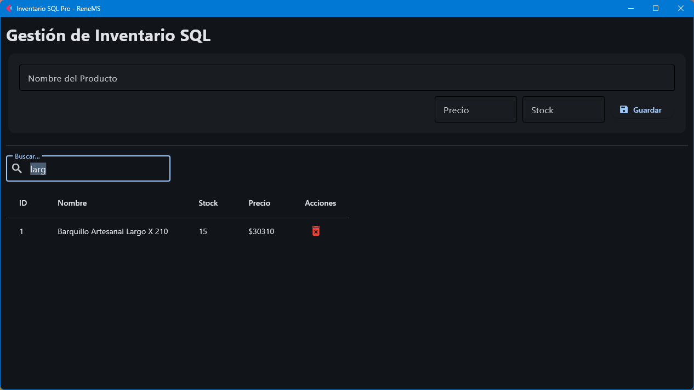
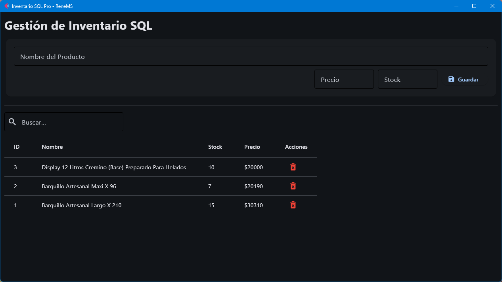

# 📦 Sistema de Gestión de Inventario SQL


> Sistema completo de gestión de inventario con **dos modos de uso**: interfaz gráfica moderna y consola interactiva. Construido con Python y SQLite para máxima portabilidad.

## 🎯 Características Principales

✅ **Doble Interfaz de Usuario**
- 🖥️ **Modo Gráfico:** Interfaz moderna con Flet (multiplataforma)
- 💻 **Modo Consola:** Terminal interactivo para uso rápido

✅ **CRUD Completo**
- ➕ Crear productos con nombre, categoría, stock y precio
- 📋 Listar inventario con búsqueda en tiempo real
- ✏️ Actualizar stock de productos existentes
- 🗑️ Eliminar productos con confirmación

✅ **Base de Datos Relacional**
- 💾 Persistencia con SQLite
- 🔒 Consultas parametrizadas (protección contra SQL Injection)
- � Sin configuración adicional requerida

## 🖼️ Capturas de Pantalla

### Interfaz Gráfica (Flet)

**Vista Principal**


**Búsqueda en Tiempo Real**


**Gestión de Productos**


### Interfaz de Consola
```
--- 🍎 SISTEMA DE INVENTARIO (CRUD COMPLETO) ---
1. Agregar Producto (Create)
2. Ver Inventario (Read)
3. Actualizar Stock (Update)
4. Eliminar Producto (Delete)
5. Salir
```

## 📁 Estructura del Proyecto

```text
gestion-inventario-sql/
├── 🎨 app_grafica.py    # Interfaz gráfica con Flet
├── 💻 main.py           # Interfaz de consola interactiva
├── 🗄️ database.py       # Capa de acceso a datos (CRUD)
├── 📊 inventario.db     # Base de datos SQLite (auto-generada)
└── 📖 README.md         # Documentación
```

## 🚀 Instalación y Uso

### Requisitos Previos
- Python 3.10 o superior
- pip (gestor de paquetes de Python)

### 1️⃣ Clonar el Repositorio

```bash
git clone https://github.com/ReneMS/gestion-inventario-sql.git
cd gestion-inventario-sql
```

### 2️⃣ Instalar Dependencias

```bash
pip install flet
```

> **Nota:** SQLite viene incluido con Python, no requiere instalación adicional.

### 3️⃣ Ejecutar la Aplicación

**Modo Gráfico (Recomendado):**
```bash
python app_grafica.py
```

**Modo Consola:**
```bash
python main.py
```

## 🛠️ Tecnologías Utilizadas

| Tecnología | Propósito |
|------------|-----------|
| **Python 3.14** | Lenguaje de programación principal |
| **SQLite3** | Base de datos relacional embebida |
| **Flet** | Framework para interfaz gráfica multiplataforma |
| **SQL** | Lenguaje de consultas (DDL/DML) |

## 📚 Funcionalidades Técnicas

### Seguridad
- ✅ Consultas parametrizadas para prevenir SQL Injection
- ✅ Validación de tipos de datos en inputs
- ✅ Manejo de excepciones robusto

### Base de Datos
```sql
CREATE TABLE productos (
    id INTEGER PRIMARY KEY AUTOINCREMENT,
    nombre TEXT NOT NULL,
    categoria TEXT,
    stock INTEGER DEFAULT 0,
    precio INTEGER NOT NULL
)
```

### Operaciones CRUD

| Operación | SQL | Función |
|-----------|-----|---------|
| **Create** | `INSERT INTO` | `insertar_producto()` |
| **Read** | `SELECT FROM` | `obtener_productos()` |
| **Update** | `UPDATE SET` | `actualizar_stock()` |
| **Delete** | `DELETE FROM` | `eliminar_producto()` |

## 🎓 Casos de Uso

- 🏪 Pequeños negocios y tiendas
- 📦 Control de almacén personal
- 🎯 Proyectos educativos de bases de datos
- 💼 Prototipado rápido de sistemas de inventario

## 🤝 Contribuciones

Las contribuciones son bienvenidas. Para cambios importantes:

1. Fork el proyecto
2. Crea una rama para tu feature (`git checkout -b feature/AmazingFeature`)
3. Commit tus cambios (`git commit -m 'Add: nueva funcionalidad'`)
4. Push a la rama (`git push origin feature/AmazingFeature`)
5. Abre un Pull Request

## 📝 Licencia

Este proyecto es de código abierto y está disponible bajo la licencia MIT.

## 👨‍💻 Autor

**ReneMS**
- GitHub: [@ReneMS](https://github.com/ReneMS)
- Proyecto: Sistema de Inventario SQL con doble interfaz

---

⭐ Si este proyecto te fue útil, considera darle una estrella en GitHub

